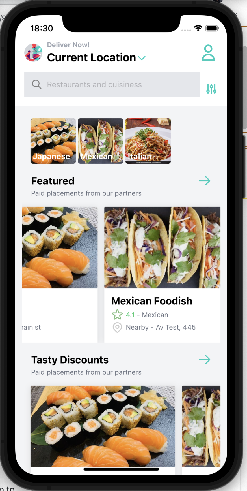

# A simple APP for Delivery.
### techonologies: React Native, Redux, Tailwind UI 

## Running the application:

```sh
npm start
```

Running the application (Mocked Backend):
```sh
npm run start:api
```


